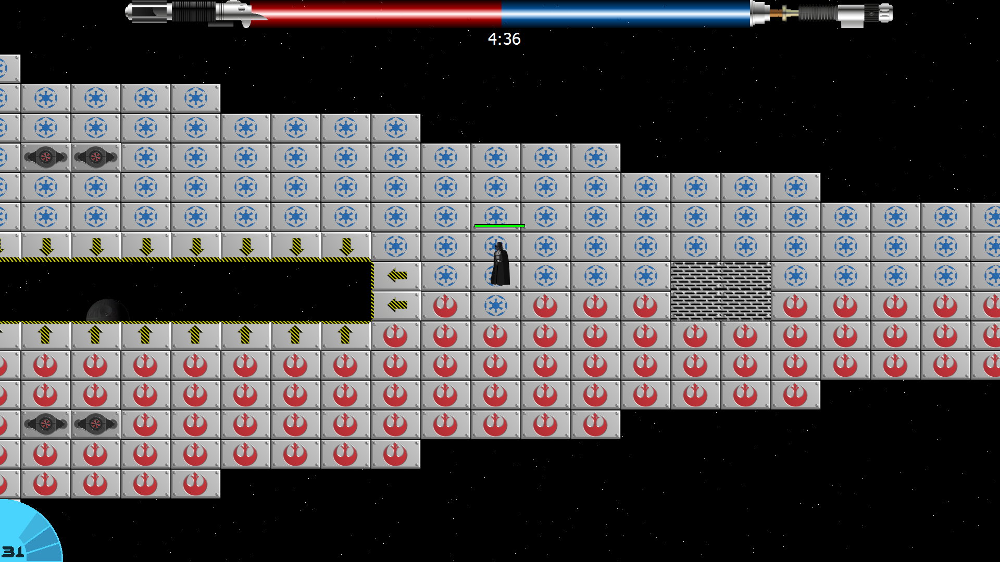
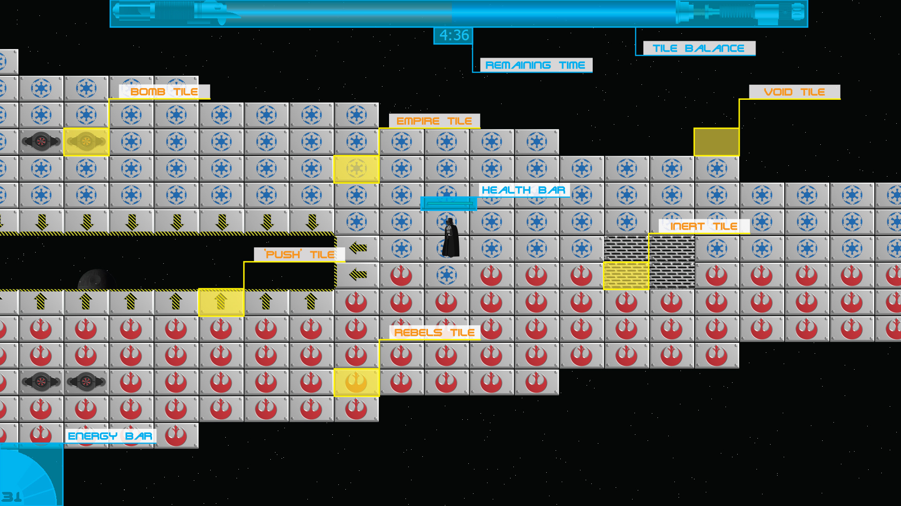
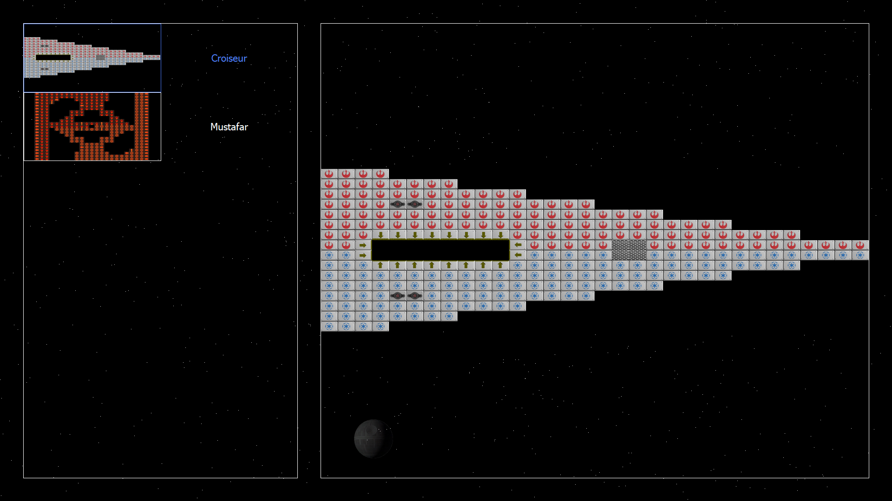
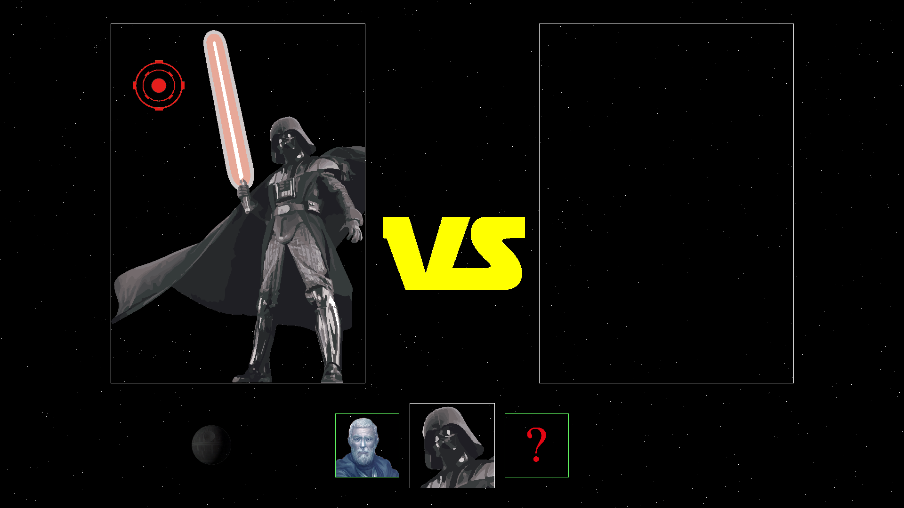
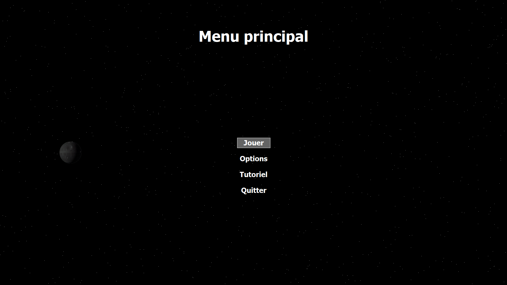
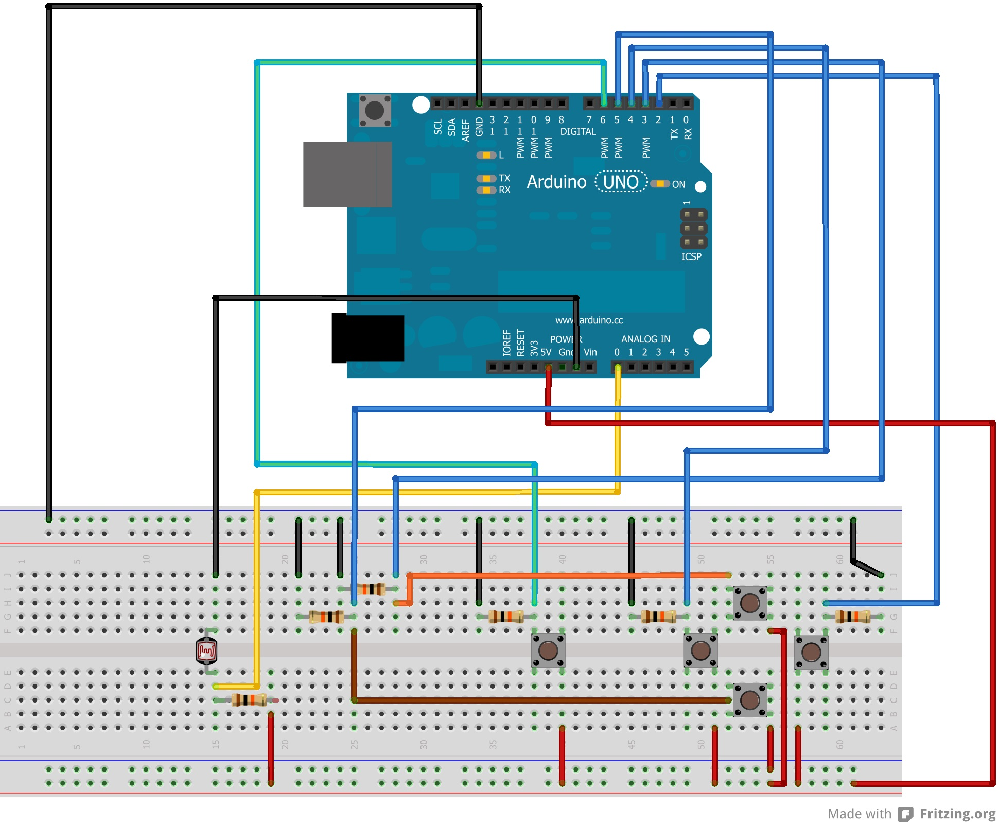

# Star Skweek

## Table of contents
[The game](#the-game)  
[Illustrations](#illustrations)  
[Requirements](#requirements)  
[Networking](#networking)  

## The game
Star Skweek is a 2D multiplayer game, made with Qt. It is a Super Skweek game ([wiki](https://en.wikipedia.org/wiki/Super_Skweek)), with a Star Wars theme.  
Star Skweek is played with two players in a duel. Most tiles that make up the map belong to one the player.
If a player steps on a tile belonging to the other player, the tile will change hands. The player with the most tiles wins the game.  
Players can shoot each others, if a player is hit, he will be stopped for a short time.
Depending on the chosen hero, players also have one special ability:  
* Obi-wan Kenobi:
	Ghost form : Obi-wan moves faster and can fly over the void.
* Darth Vader:
	Death star strike: The Death star targets a random point on the map, all tiles around the target are given to Darth Vader. If the other player is hit, is will be stopped for a short time.

## Illustrations

- Convert tiles, the player with the most tiles wins the game

- User interface

- Pick a map

- Pick a hero

- Main menu

## Requirements
- [Qt](https://www.qt.io/)
- [Arduino software](https://www.arduino.cc/en/Main/Software) + Arduino controller, layout :  

## Widgets
- MainWindow:  
	This is the container for all widgets. The MainWindow is responsible for displaying the background and processing user inputs.

- MainMenuWidget:  
	This widget is used to displayed the Main menu and guide the player to the lobby. It also contains options, displayed with the OptionWidget.  
	Menus are drawn in the __paintEvent__, provided by Qt. This basically allows us to draw on the widget as if it was an image. The same technique is used for all the following widgets.

- OptionWidget:  
	This widget allows the user to navigate through options and to focus one, to then change its value.  

- LobbyWidget:  
	This widget is responsible for hosting/joining and setting up a game, including map and character selection.

- GameWidget:  
	This widget contains all game elements. Including the map, characters, projectile, animations, and UI.  
	All types of game element have their own method to draw them, to ensure that the code is well organized.  
	With more time, each type of game element would have become a separate widget (UI, above all).

## Networking
Networking is made with TPC, to ensure that data are transmitted reliably.  
Packets are sent once per frame, and multiple packets can be sent per frame. Packets follow this structure:  
[UpdateType, UpdateData].  
UpdateData can have different structures, depending on UpdateType:
- Player sends his name : [Player_name]
- Player selects character : [Character_index]
- Player is ready : []
- Player move : [Current_Position.x, Current_Position.y, Direction]
- Player uses power (Darth Vader) : [RandomStart.x, RandomStart.y, RandomTarget.x, RandomTarget.y]
- Player uses power (Obi-wan) : []